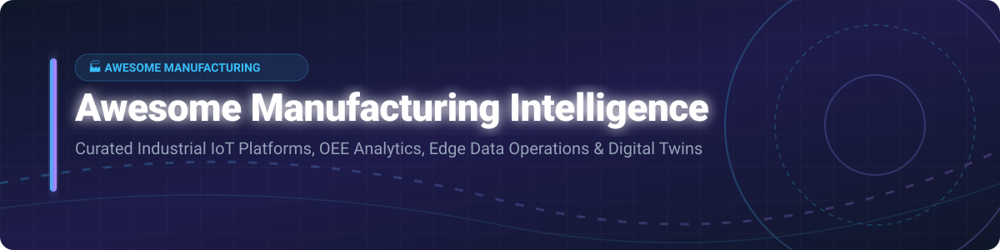

<p align="center">
  
</p>

# 🏭 Awesome Manufacturing Intelligence 🚀

<p align="center">
  <a href="https://github.com/ishandutta2007/Awesome-Awesome-Awesome"></a><a href="https://discord.gg/jc4xtF58Ve"></a>
  <a href="https://github.com/ishandutta2007/Awesome-Manufacturing-Intelligence/stargazers"></a>
  <a href="https://github.com/ishandutta2007/Awesome-Manufacturing-Intelligence/network/members"></a>
  <a href="https://github.com/ishandutta2007/Awesome-Manufacturing-Intelligence/blob/main/LICENSE"></a>
  <a href="https://github.com/ishandutta2007"></a>
</p>

## 📊 Top Manufacturing Intelligence Platforms Ecosystem

> **Curated directory of enterprise SaaS solutions, Industrial IoT (IIoT) platforms, and open-source manufacturing software for Overall Equipment Effectiveness (OEE), process analytics, edge computing, digital twins, and AI production insights.** 🏭⚡

---

### 🌐 Sector Overview & Market Dynamics

> 💡 **Market Size & Structure**: The global Manufacturing Intelligence and Industrial IoT (IIoT) market is estimated at **~$28.5 Billion** and projected to reach **~$68 Billion by 2030** (CAGR ~15%). The market is **moderately fragmented**, balancing hyper-scale enterprise platforms (C3 AI, Sight Machine, Ignition) with specialized edge data operations utilities (HighByte, Litmus) and vertical-specific process analytics solutions.

---

## 📋 Table of Contents
- [🏭 SaaS & Enterprise Hosted Platforms](#-saas--enterprise-hosted-platforms)
- [🔓 Open-Source Manufacturing Software & Libraries](#-open-source-manufacturing-software--libraries)
- [🤝 How to Contribute](#-how-to-contribute)
- [💖 Support & Sponsorship](#-support--sponsorship)
- [📈 Star History](#-star-history)
- [⚠️ Disclaimer](#%EF%B8%8F-disclaimer)

---

## 🏭 SaaS & Enterprise Hosted Platforms

Below is a curated comparison of leading commercial Manufacturing Intelligence, IIoT Data Ops, and Process Analytics SaaS solutions, sorted by company size/valuation (descending).

| SaaS Platform 🚀 | Description 📝 | Company Size / Valuation / Revenue 💰 | Starting Pricing Tier 💳 | Free Tier / Free Trial Limits ⏳ |
| :--- | :--- | :--- | :--- | :--- |
| **[C3 AI Manufacturing](https://c3.ai/)** | Enterprise AI application suite for predictive maintenance, yield optimization, and supply chain. | **$1.70 Billion** Valuation (Public NYSE: AI) / ~$250M Annual Rev | ~$20,000 / month starting application tier | 14-Day Free Trial (limited sandbox environment) |
| **[Ignition Cloud](https://inductiveautomation.com/)** | Cloud & hybrid SCADA, IIoT, and manufacturing intelligence platform by Inductive Automation. | **~$150M** Annual Revenue | ~$1.20 / hour (Pay-As-You-Go on AWS/Azure Marketplace) | Unlimited Free Trial (resets gateway every 2 hours) + Free Maker Edition for non-commercial use |
| **[Sight Machine](https://sightmachine.com/)** | Continuous manufacturing intelligence & digital twin platform for plant-wide analytics. | **~$147M** Valuation (~$124M Raised, ~$20M Rev) | ~$10,000 / month starting plant deployment | 30-Day Guided Proof-of-Concept Trial |
| **[MachineMetrics](https://www.machinemetrics.com/)** | Autonomous IIoT asset monitoring & OEE analytics platform for discrete manufacturing. | **~$45M** Funding (~$12M Annual Rev) | ~$300 / machine / month (Professional Tier) | 30-Day Hardware-Agnostic Free Trial (up to 5 machine connections) |
| **[Litmus](https://litmus.io/)** | Edge data platform collecting, normalizing, and routing industrial machine data to cloud backends. | **~$37M** Funding (~$10M Annual Rev) | ~$250 / edge node / month | Free Litmus Edge Developer Edition (Full features, single-node evaluation) |
| **[Seeq](https://www.seeq.com/)** | Advanced time-series analytics and diagnostic platform for process manufacturing. | **~$35M** Funding (~$15M Annual Rev) | ~$500 / user / month (SaaS Tier) | 14-Day Guided Evaluation Trial |
| **[HighByte](https://www.highbyte.com/)** | Industrial DataOps software hub contextualizing and modeling OT data for IT pipelines. | **~$15M** Funding (~$5M Annual Rev) | $17,500 / year (Single Factory License) | 30-Day Full-Featured Trial License + 2-Hour Rapid Test Drive |
| **[Braincube](https://braincube.com/)** | Edge-to-cloud IIoT AI suite for production process optimization & continuous improvement. | **~$12M** Funding (~$8M Annual Rev) | ~$1,500 / site / month | 30-Day Proof-of-Concept Pilot Trial |
| **[TrendMiner](https://www.trendminer.com/)** | Self-service industrial analytics for process engineers on time-series plant data. | Software AG Subsidiary (~$10M Rev) | ~$1,200 / user / month | 14-Day Enterprise Sandbox Trial |

---

## 🔓 Open-Source Manufacturing Software & Libraries

The following open-source building blocks allow engineering teams to build self-hosted Manufacturing Intelligence, OEE, and IIoT data pipelines. Sorted by GitHub Star Count (descending).

| Open-Source Project 🛠️ | Description 💡 | GitHub Stars ⭐ |
| :--- | :--- | :--- |
| **[Node-RED](https://github.com/node-red/node-red)** | Low-code flow-based programming tool widely used for IIoT machine data integration and transformation pipelines. | [](https://github.com/node-red/node-red/stargazers) |
| **[ThingsBoard](https://github.com/thingsboard/thingsboard)** | Open-source IoT platform for device management, data collection, processing, and industrial dashboard visualization. | [](https://github.com/thingsboard/thingsboard/stargazers) |
| **[Eclipse Mosquitto](https://github.com/eclipse-mosquitto/mosquitto)** | Lightweight open-source MQTT message broker ideal for edge-to-cloud machine telemetry data transport. | [](https://github.com/eclipse-mosquitto/mosquitto/stargazers) |
| **[EMQX](https://github.com/emqx/emqx)** | Enterprise-grade, open-source distributed MQTT broker for high-throughput IIoT data streaming and machine connectivity. | [](https://github.com/emqx/emqx/stargazers) |
| **[open62541](https://github.com/open62541/open62541)** | Open-source C implementation of OPC UA (IEC 62541) protocol for industrial PLC and SCADA interoperability. | [](https://github.com/open62541/open62541/stargazers) |
| **[Prometheus](https://github.com/prometheus/prometheus)** | Cloud-native metrics collector and time-series database adapted for plant-floor machine telemetry & OEE alerts. | [](https://github.com/prometheus/prometheus/stargazers) |
| **[Telegraf](https://github.com/influxdata/telegraf)** | Plugin-driven server agent for collecting and reporting metrics from industrial sensors, Modbus, and OPC UA. | [](https://github.com/influxdata/telegraf/stargazers) |
| **[Apache StreamPipes](https://github.com/apache/streampipes)** | Self-service Industrial IoT toolbox enabling non-coders to analyze and stream manufacturing data feeds. | [](https://github.com/apache/streampipes/stargazers) |
| **[OpenMES](https://github.com/Mes-Open/OpenMes)** | Free open-source Manufacturing Execution System providing real-time OEE, downtime tracking, and shop-floor control. | [](https://github.com/Mes-Open/OpenMes/stargazers) |
| **[Libre (Spruik)](https://github.com/Spruik)** | Open manufacturing execution and performance monitoring stack built on Grafana, InfluxDB, and Postgres for OEE analytics. | [](https://github.com/Spruik/stargazers) |

---

## 🛠️ Architecture & Reference Implementation Patterns

```
┌─────────────────┐       ┌─────────────────┐       ┌───────────────────┐
│ Industrial PLCs │  ───► │  Edge Connect   │  ───► │  Data Ops Hub     │
│ (OPC UA/Modbus) │       │ (Node-RED/EMQX) │       │ (HighByte/Litmus) │
└─────────────────┘       └─────────────────┘       └───────────────────┘
                                                              │
                                                              ▼
┌─────────────────┐       ┌─────────────────┐       ┌───────────────────┐
│ Plant Dashboards│  ◄─── │  OEE Analytics  │  ◄─── │ Time-Series Store │
│ (Grafana/OpenMES│       │ (Sight/Machine) │       │ (InfluxDB/Prom)   │
└─────────────────┘       └─────────────────┘       └───────────────────┘
```

---

## 🤝 How to Contribute

Contributions are welcome! Please follow these simple guidelines:

1. 🍴 **Fork** the repository.
2. 📝 **Add or update** entries in `README.md` maintaining table formatting.
3. 🔎 Ensure descriptions are factual, clear, and include proper links.
4. 📬 Submit a **Pull Request** with a brief summary of additions.

Refer to [Awesome-Awesome-Awesome](https://github.com/ishandutta2007/Awesome-Awesome-Awesome) for generic list standards.

---

## 💖 Support & Sponsorship

If you find this curated list valuable for your industrial digital transformation projects or research, please consider supporting the project!

- ⭐ **Star** this repository to help others discover it.
- 🔀 **Fork** and contribute new manufacturing platforms or open tools.
- 📢 **Share** with your manufacturing, IIoT, and OT/IT automation networks.
- ☕ **Buy me a coffee**: Support ongoing curation on [GitHub Sponsors](https://github.com/sponsors/ishandutta2007).

---

## 📈 Star History

[](https://star-history.dera.page/#ishandutta2007/Awesome-Manufacturing-Intelligence&type=date&legend=top-left)

---

## ⚠️ Disclaimer

- This is a **community-curated** educational directory — not an endorsement of any vendor or software package.
- Industrial data systems interface directly with factory production hardware. Self-built or open-source implementations require rigorous OT security, network isolation, and change validation.
